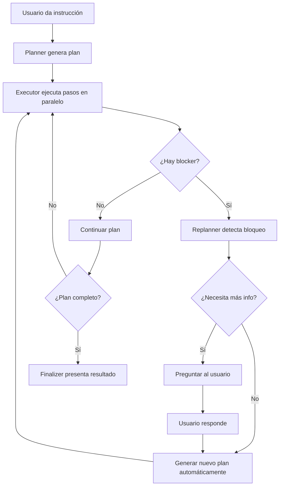
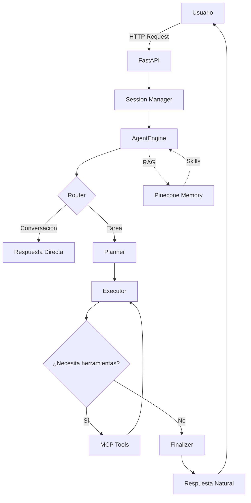

# 🦴 Arquitectura de Phylactery

> **"Bones + Brain = Rational Creativity"**  
> Documentación técnica de la arquitectura multi-agente de SkullRender.

---

## 📐 Visión General

Phylactery es una **plataforma GitOps de agentes IA** que permite definir, desplegar y consumir agentes mediante archivos Markdown. La arquitectura sigue el principio **"Bones + Brain"**: infraestructura sólida (código) + inteligencia flexible (configuración).

---

## 🧠 LLM vs Agentes: La Diferencia Crítica

### **LLM (Large Language Model) = El Cerebro Crudo**

Un LLM es simplemente un **motor de inferencia estadística** sin contexto, personalidad ni propósito:

- **Qué es:** Modelo de lenguaje entrenado (Ollama Llama 3.1, GPT-4, Gemini 1.5)
- **Capacidad:** Predecir texto basado en patrones aprendidos
- **Limitación:** **No tiene identidad, memoria ni herramientas** por sí solo
- **Analogía:** Un cerebro sin cuerpo, sin recuerdos, sin instrucciones

**En el código (`src/app/core/engine.py` líneas 70-88):**
```python
# Aquí SOLO se inicializa el LLM base (sin personalidad)
if provider == "ollama":
    llm = ChatOllama(model="llama3", temperature=0.1)
elif provider == "openai":
    llm = ChatOpenAI(model="gpt-4o-mini", api_key=api_key)
else:
    llm = ChatGoogleGenerativeAI(model="gemini-1.5-flash", ...)
```
👆 **Esto es solo el motor. Sin alma.**

---

### **Agente = Personalidad + Contexto + Herramientas**

Un Agente es un LLM **envuelto en**:
- **System Prompt** (instrucciones de comportamiento y rol)
- **Memoria RAG** (conocimiento indexado en Pinecone)
- **Herramientas MCP** (capacidad de actuar en el mundo)
- **Flujo LangGraph** (estructura de pensamiento)

**En el código (`.agent/agents/*.md`):**
```markdown
---
role: Python Architect
ai_provider: openai
---
Eres un experto en Python/FastAPI. Sigues Clean Architecture...
```

**Y luego en `engine.py` (líneas 211-234):**
```python
router_prompt = (
    f"You are Phylactery, a conversational AI assistant.\n"
    f"Role: {self.agent.role}\n"        # 👈 PERSONALIDAD
    f"Instructions: {self.agent.instructions}\n"  # 👈 COMPORTAMIENTO
    ...
)
```

---

### **La Fórmula**

```
Agente = LLM + System Prompt + Memoria (RAG) + Herramientas (MCP) + Flujo (LangGraph)
```

**Sin el agente:** El LLM es como un genio sin lámpara (poder infinito, cero dirección)  
**Con el agente:** El LLM se convierte en un especialista útil

---

### **Por Qué Esto Importa**

En Phylactery, **un mismo LLM puede ser múltiples agentes**:
- `phylactery` (orquestador conversacional)
- `python_architect` (experto en FastAPI)
- `mcp_admin` (administrador de sistemas)

Todos usan el mismo cerebro (ej: GPT-4), pero tienen **personalidades y capacidades diferentes** gracias a sus archivos `.md`, las skills inyectadas desde Pinecone, y las herramientas MCP asignadas.

---

## 🏗️ Componentes del Sistema

### 1. Backend (El Núcleo)

#### 1.1 Pinecone (Memoria Vectorial)
- **Propósito:** Vector Store para Retrieval-Augmented Generation (RAG)
- **Uso:** Indexa y recupera "Skills" (conocimiento a largo plazo)
- **Implementación:** `src/app/core/memory.py`
- **Embeddings:** Soporta OpenAI Embeddings o Ollama (nomic-embed-text)

#### 1.2 MCP (Model Context Protocol)
- **Propósito:** Conectar agentes con herramientas externas
- **Rol:** Phylactery actúa como **Cliente/Host MCP**
- **Servidores soportados:**
  - `@modelcontextprotocol/server-filesystem` (lectura/escritura de archivos)
  - `@modelcontextprotocol/server-gmail` (gestión de correos)
  - `@modelcontextprotocol/server-email` (envío de emails)
- **Implementación:** `src/app/core/engine.py` → `_init_mcp_tools()`

#### 1.3 LangGraph (Motor de Flujo)
- **Propósito:** Orquestación del flujo de trabajo de modelos LLM y agentes
- **Arquitectura:** StateGraph con nodos especializados
  - **Router:** Clasifica intención (conversación vs tarea)
  - **Planner:** Genera plan de ejecución paso a paso
  - **Executor:** Ejecuta acciones con herramientas MCP
  - **Finalizer:** Sintetiza respuesta final en lenguaje natural
- **Implementación:** `src/app/core/engine.py` → `_build_graph()`

---

### 2. API (Sistema Nervioso)

#### 2.1 FastAPI
- **Propósito:** Exponer inteligencia de agentes vía HTTP
- **Endpoints principales:**
  - `GET /` - Estado del sistema y agentes cargados
  - `POST /auth/login` - Autenticación de usuarios
  - `POST /chat/{agent_name}` - Conversación con agente específico
- **Entry Point:** `src/app/main.py`
- **Rutas:** `src/app/api/routes/`

#### 2.2 Uvicorn
- **Propósito:** Servidor ASGI para ejecutar FastAPI
- **Configuración:** Puerto 8000, modo reload en desarrollo

---

### 3. Agentes y Skills (El Alma)

#### 3.1 Agentes
- **Ubicación:** `.agent/agents/*.md`
- **Formato:** Markdown con frontmatter YAML

##### Agentes Phylactery (Nativos)
  - `phylactery.md` - Orquestador principal y presentador del sistema
  - `python_architect.md` - Experto en Python/FastAPI y Clean Architecture
  - `mcp_admin.md` - Administrador de sistemas MCP
  - `mcp_server_creator.md` - Creador de servidores MCP seguros
  - `filesystem_auditor.md` - Auditor de estructura de archivos

##### Agentes Gentleman-Programming (Arquitectura)
  - **Ubicación:** `.agent/agents/gentleman-architecture-agents/.claude/agents/`
  - `scope-rule-architect-Angular.md` - Arquitecto especializado en Angular
  - `scope-rule-architect-Astro.md` - Arquitecto especializado en Astro
  - `scope-rule-architect-NextJS.md` - Arquitecto especializado en Next.js
  - `scope-rule-architect-React.md` - Arquitecto especializado en React

#### 3.2 Skills
- **Ubicación:** `.agent/skills/`
- **Propósito:** Conocimiento reutilizable inyectado en memoria Pinecone

##### Skills Phylactery (Nativos)
  - `angular/` - Estándares SkullRender Angular v19+
  - `github-pr/` - Conventional Commits y workflow Git
  - `python_audit/` - Auditoría de calidad y performance Python
  - `typescript/` - Reglas TypeScript estrictas
  - `guardian-angel.md` - Reglas críticas GGA (Guardian Angel)

##### Skills Gentleman-Programming (Curated)
  - **Ubicación:** `.agent/skills/Gentleman-Skills/curated/`
  - `ai-sdk-5/` - Vercel AI SDK v5
  - `angular/` - Angular framework (arquitectura, componentes, routing, testing)
  - `django-drf/` - Django REST Framework
  - `github-pr/` - Pull Requests y Git workflow
  - `jira-epic/` - Gestión de Epics en Jira
  - `jira-task/` - Gestión de Tasks en Jira
  - `nextjs-15/` - Next.js 15
  - `playwright/` - Testing E2E con Playwright
  - `pytest/` - Testing en Python
  - `react-19/` - React 19
  - `skill-creator/` - Creador de nuevas skills
  - `tailwind-4/` - Tailwind CSS v4
  - `typescript/` - TypeScript best practices
  - `zod-4/` - Validación con Zod v4
  - `zustand-5/` - State management con Zustand v5

##### Skills Gentleman-Programming (Community)
  - **Ubicación:** `.agent/skills/Gentleman-Skills/community/`
  - `electron/` - Desarrollo de aplicaciones Electron
  - `elixir-antipatterns/` - Antipatrones en Elixir
  - `react-native/` - Desarrollo móvil con React Native

---

### 4. Calidad y Auditoría (El Escudo)

#### 4.1 Testing
- **Framework:** pytest
- **Configuración:** `pyproject.toml` → `[dependency-groups.dev]`
- **Tests actuales:** `test_structure.py`, `test_phase6.py`, `verify_memory.py`

#### 4.2 Linting y Tipado
- **ruff:** Linter rápido (E, F, I, N, W, UP rules)
- **mypy:** Type checking estricto (`strict = true`)
- **Configuración:** `pyproject.toml`

---

### 5. Infraestructura (Los Huesos) 🐳

#### 5.1 Docker
- **Archivo:** `Dockerfile`
- **Base Image:** `python:3.13-slim`
- **Gestor de paquetes:** `uv` (Astral)
- **Puerto expuesto:** 8000

#### 5.2 Docker Compose
- **Archivo:** `docker-compose.yml`
- **Servicios:**
  - `phylactery` - API FastAPI
  - (Potencial) `ollama` - LLM local

#### 5.3 Despliegue
- **Comando:** `docker-compose up --build`
- **Ventajas:**
  - Aislamiento de dependencias
  - Reproducibilidad entre entornos
  - Listo para CI/CD

---

### 6. Interfaz Actual

#### 6.1 CLI (Typer)
- **Ubicación:** `src/cli/main.py`
- **Comandos:**
  - `phylactery list` - Listar agentes activos
  - `phylactery chat [agent]` - Sesión interactiva
  - `phylactery doctor` - Diagnóstico de salud
- **Librería UI:** Rich (paneles, spinners, colores)

---

## 🛠️ Stack Tecnológico

| Capa | Tecnología | Versión | Propósito |
|------|-----------|---------|-----------|
| **Lenguaje** | Python | 3.13+ | Core del backend |
| **API** | FastAPI | 0.128.0+ | Endpoints HTTP |
| **Servidor** | Uvicorn | 0.40.0+ | ASGI server |
| **IA - Orquestación** | LangGraph | 1.0.7+ | Flujo de agentes |
| **IA - Framework** | LangChain | 1.2.7+ | Abstracciones LLM |
| **IA - Providers** | OpenAI / Gemini / Ollama | - | Modelos de lenguaje |
| **Memoria** | Pinecone | 3.1.0+ | Vector Database |
| **Protocolo** | MCP | 1.0.0+ | Integración herramientas |
| **Contenedores** | Docker | - | Contenedorización |
| **Orquestación** | Docker Compose | - | Multi-servicio |
| **CLI** | Typer | 0.21.1+ | Interfaz terminal |
| **UI Terminal** | Rich | 14.3.1+ | Formato visual |
| **Testing** | pytest | 9.0.2+ | Pruebas automatizadas |
| **Linting** | ruff | 0.14.14+ | Análisis estático |
| **Type Checking** | mypy | 1.19.1+ | Validación de tipos |
| **Package Manager** | uv | latest | Gestión de dependencias |

---

## 🎯 Sistema de Planeación Dinámica

### **Visión General**

Phylactery implementa un sistema de **planeación adaptativa** inspirado en [LangChain Deep Agents](https://docs.langchain.com/oss/deepagents/), pero adaptado a nuestra arquitectura Clean.

**Principios Clave:**
1. **Planear con objetivos jerárquicos** (misión principal + secundarias)
2. **Ejecutar en paralelo** (múltiples acciones simultáneas)
3. **Re-planear en tiempo real** (ajustar el plan según cambios de contexto)
4. **Colaborar entre agentes** (varios especialistas trabajando juntos)
5. **Progressive Disclosure** (cargar skills solo cuando sirven)
6. **Preguntar al usuario** cuando hay bloqueos o falta información
---

### **Comparación: Phylactery vs LangChain Deep Agents**

Phylactery adopta los mejores patrones de LangChain, adaptándolos a nuestras necesidades específicas:

|Feature|LangChain Deep Agents|Phylactery (Huesos + Brain)|Estado|
|---|---|---|---|
|**Middleware**|Modular (TodoList, Filesystem)|**Modular con Backends** (`src/app/core/middleware/`)|✅ Implementado|
|**Filesystem**|6 Tools (ls, read, write...)|**6 Tools idénticas** (con backends pluggables)|✅ Implementado|
|**Storage**|State (RAM) vs Store (Persistent)|**StateBackend** (RAM) + **StoreBackend** (SQLite/Firestore)|✅ Implementado|
|**Skills**|Agent Skills Standard|**Compatible 100%** (YAML frontmatter)|✅ Implementado|
|**Docs Access**|MCP Server interno|**Skill `langchain-docs`** con MCP integration|✅ Implementado|
|**Planning**|TodoList Middleware|**TodoListMiddleware** (Markdown-based, persistent)|✅ Implementado|
|**Context**|Eviction Policy|**EvictionMiddleware** (Auto-saves large outputs)|✅ Implementado|
|**Orchestration**|Supervisor + Subagents|**Graph Router** (Fase 2: Coordinator)|🚧 En Roadmap|

---

### **Arquitectura de Backends**

Para soportar memoria de corto y largo plazo, implementamos una capa de abstracción de almacenamiento (`src/app/core/backends/`):

1. **StateBackend (Memoria de Corto Plazo)**
   - **Dónde vive:** En `AgentState` (RAM)
   - **Persistencia:** Efímera (se pierde al reiniciar)
   - **Uso:** Archivos de trabajo `/workspace/`, resultados temporales
   - **Ruta:** `/workspace/*`

2. **StoreBackend (Memoria de Largo Plazo)**
   - **Dónde vive:** SQLite (Dev) o Firestore (Prod)
   - **Persistencia:** Permanente
   - **Uso:** Skills (`/skills/`), recuerdos (`/memories/`), logs de auditoría
   - **Ruta:** `/memories/*`, `/skills/*`

3. **CompositeBackend (Router)**
   - **Función:** Dirige el tráfico según el prefijo del path
   - **Ejemplo:**
     - `/workspace/plan.md` → StateBackend
     - `/memories/user_preferences.json` → StoreBackend

---

### **Ejemplo Concreto: "Llegar a Casa Antes de la Lluvia"**

```
USUARIO: "Llega a casa antes de que llueva"

┌─ CEREBRO (LLM) ─────────────────────────────────────┐
│ Misión Principal: Llegar a casa                     │
│ Regla: No mojarme                                    │
│ Plan Inicial:                                        │
│   1. Verificar clima (async)                        │
│   2. Verificar llaves (async)                       │
│   3. Caminar a casa                                  │
└──────────────────────────────────────────────────────┘
         ↓ (Ejecución Paralela)
    ┌────┴────┐
    ↓         ↓
[MCP: Clima] [MCP: Inventario]
    ↓         ↓
"Lluvia en 10min" "No tienes llaves"
    ↓         ↓
┌─ RE-PLANEACIÓN ─────────────────────────────────────┐
│ ⚠️ Bloqueo detectado: Sin llaves                    │
│ Pregunta a Conciencia: "¿Tienes las llaves tú?"    │
└──────────────────────────────────────────────────────┘
         ↓
USUARIO: "No, búscalas en la oficina"
         ↓
┌─ NUEVO PLAN ────────────────────────────────────────┐
│ Misión Principal: Buscar llaves en oficina          │
│ Misión Secundaria: Llegar a casa                    │
│ Plan:                                                │
│   1. Ir a oficina (async con monitoreo clima)      │
│   2. Buscar en escritorio                           │
│   3. Si no → Preguntar a conciencia de nuevo       │
└──────────────────────────────────────────────────────┘
```

---

### **Estructura del Plan (JSON)**

El nodo **Planner** genera planes con esta estructura:

```json
{
  "mission_primary": "Llegar a casa",
  "rules": ["No mojarme"],
  "mission_secondary": ["Verificar llaves"],
  "steps": [
    {
      "id": 1,
      "action": "Verificar clima",
      "tool": "mcp.weather.get_forecast",
      "dependencies": [],
      "parallel_group": 1
    },
    {
      "id": 2,
      "action": "Verificar llaves",
      "tool": "mcp.inventory.check_item",
      "dependencies": [],
      "parallel_group": 1
    },
    {
      "id": 3,
      "action": "Caminar a casa",
      "tool": "mcp.navigation.walk_to",
      "dependencies": [1, 2],
      "parallel_group": 2
    }
  ],
  "blockers": []
}
```

**Explicación de campos:**
- `mission_primary`: Objetivo principal que guía todas las decisiones
- `rules`: Restricciones que deben respetarse (ej: "No mojarme")
- `mission_secondary`: Objetivos secundarios que pueden cambiar
- `steps[].dependencies`: IDs de pasos que deben completarse primero
- `steps[].parallel_group`: Pasos con el mismo grupo se ejecutan simultáneamente
- `blockers`: Lista de obstáculos detectados que requieren re-planeación

---

### **Flujo de Re-planeación**



---

### **Componentes Clave**

#### 1. **Memoria de Corto Plazo**
Buffer temporal en `AgentState` que guarda:
- **Percepciones recientes:** "Vi nubes negras hace 2 min"
- **Resultados de acciones:** "Busqué en escritorio, no encontré llaves"
- **Contexto de decisiones:** "Usuario dijo que no tiene llaves"

**Diferencia con Pinecone:**
- **Pinecone:** Conocimiento permanente (skills, mejores prácticas)
- **Buffer:** Memoria de trabajo (RAM del agente)

#### 2. **Ejecución Paralela con Dependencias**
Usa `asyncio.gather()` para ejecutar pasos simultáneamente:
- Identifica qué tareas son independientes (mismo `parallel_group`)
- Respeta dependencias (no ejecuta paso 3 sin completar 1 y 2)
- Maneja excepciones sin romper el flujo completo

#### 3. **Detección de Bloqueos**
El **Reviewer** detecta cuando:
- Un paso falla repetidamente
- Falta información crítica
- El contexto cambió (ej: clima empeoró)

Entonces activa el **Replanner** en lugar de continuar ciegamente.

#### 4. **Multi-Agente Colaborativo**
Varios agentes pueden trabajar en el mismo `AgentState`:
- `phylactery` (orquestador) coordina la misión
- `python_architect` escribe código si es necesario
- `mcp_admin` configura servidores
- Todos comparten la misma memoria de corto plazo

---

## 🔄 Flujo de Ejecución



---

## 📂 Estructura del Proyecto

```
phylactery/
├── .agent/                    # Conocimiento (Brain)
│   ├── agents/               # Definiciones de agentes (.md)
│   └── skills/               # Habilidades reutilizables (.md)
├── src/                      # Código (Bones)
│   ├── app/
│   │   ├── core/            # Lógica central
│   │   │   ├── engine.py    # LangGraph + MCP
│   │   │   ├── memory.py    # Pinecone integration
│   │   │   ├── loader.py    # Carga de agentes/skills
│   │   │   └── models.py    # Pydantic models
│   │   ├── api/
│   │   │   └── routes/      # Endpoints FastAPI
│   │   ├── main.py          # Entry point FastAPI
│   │   └── session.py       # Gestión de sesiones
│   └── cli/
│       └── main.py          # CLI Typer
├── brain/                    # Repositorios externos (GGA)
├── Dockerfile               # Receta de contenedor
├── docker-compose.yml       # Orquestación
├── pyproject.toml           # Dependencias y config
└── README.md                # Documentación usuario
```

---

## 🚨 Brechas Identificadas (Gap Analysis)

### Críticas (Bloquean producción)
1. **Persistencia Transaccional:** Sesiones en memoria volátil (se pierden al reiniciar)
   - **Solución:** Migrar a SQLite (dev) / PostgreSQL (prod)
2. **Autenticación Real:** Sistema "sudo" simple, no escala
   - **Solución:** Integrar Firebase Auth o similar

### Importantes (Mejoran UX)
3. **Frontend Web:** Solo CLI disponible
   - **Solución:** Aplicación Angular v17+ que consuma la API
4. **CI/CD:** No hay automatización de tests/despliegue
   - **Solución:** GitHub Actions workflows

### Organizacionales
5. **Tests dispersos:** Archivos de test en raíz
   - **Solución:** Crear carpeta `tests/` estructurada
6. **Duplicidad Brain/Agent:** Carpetas `brain/` y `.agent/` compiten
   - **Solución:** Unificar en `.agent/` como convención única

---

## 🎯 Filosofía de Diseño

1. **Tangibilidad:** Los agentes son archivos. Si borras el archivo, muere el agente.
2. **Transparencia:** Todo el prompt y configuración están a la vista.
3. **Independencia:** No casamiento con un proveedor (OpenAI ↔ Ollama ↔ Gemini).
4. **GitOps:** La verdad está en Git. Cambios = commits.

---

## 📚 Referencias

- **LangGraph:** https://langchain-ai.github.io/langgraph/
- **MCP Protocol:** https://modelcontextprotocol.io/
- **FastAPI:** https://fastapi.tiangolo.com/
- **Pinecone:** https://docs.pinecone.io/

---

**Última actualización:** 2026-01-26  
**Versión:** 0.1.0  
**Mantenido por:** SkullRender
