# Phylactery Runtime Workflow

**Version:** 3.5.1 SEALED  
**Status:** Core Implementation Complete, LLM Nodes Pending  
**Last Updated:** 2026-01-27

---

## Overview

This document describes the **operational flow** of Phylactery's agentic runtime from user request to final response. It complements `TECHNICAL_FLOW.md` (architecture) and `SECURITY_WHITEPAPER.md` (theory) with **concrete execution paths**.

**Use this for:**
- Understanding request lifecycle
- Debugging state transitions
- Onboarding new developers
- Verifying correctness of new features

---

## 1. Request Lifecycle (Complete Flow)

```mermaid
sequenceDiagram
    participant U as User
    participant API as FastAPI Ingress
    participant G as LangGraph Runtime
    participant R as Router
    participant S as Supervisor
    participant E as Executor (LLM)
    participant RG as RiskGate
    participant T as Tools (MCP)
    participant I as Interpreter
    participant F as Finalizer
    
    U->>API: POST /agent/run {"message": "Send email to boss"}
    API->>API: DLP sanitization
    API->>API: Intent classification (heuristic)
    API->>G: Invoke graph with initial state
    
    G->>R: Route based on intent
    R->>S: intent=task, no plan → goto Supervisor
    S->>E: Propose next action
    E->>RG: proposed_tool={name, args, canonical_args, args_hash}
    
    RG->>RG: Recalculate canonical + hash
    RG->>RG: Verify integrity
    RG->>RG: Evaluate risk policy
    
    alt Risk Policy = ALLOW
        RG->>T: Execute tool
        T->>I: last_tool_result
        I->>I: Check eviction (size > 10k?)
        I->>S: Clear proposed_tool, update step_status
    else Risk Policy = AUTH_REQUIRED
        RG->>U: AwaitApproval: "APROBAR auth_xyz <token>"
        U->>API: "APROBAR auth_xyz v1.123..."
        API->>G: Router → ApprovalHandler
        G->>G: 7-factor validation
        G->>T: Execute after approval
    else Risk Policy = BLOCKED
        RG->>I: last_tool_result={status:failed, reason}
        I->>S: Log security finding
    end
    
    S->>F: Task complete → Finalizer
    F->>API: Final response
    API->>U: 200 OK {"response": "Email sent"}
```



---

## 2. Node-by-Node Execution Details

### 2.1 API Ingress (FastAPI Layer)

**Status:** ⚠️ Not Implemented (Phase 4)

**Responsibilities:**
1. **Authentication**: Verify user session/JWT
2. **DLP Sanitization**: Redact PII, secrets (using `dlp.py`)
3. **Intent Classification**: 
   - Heuristic regex (`"send email"` → `task`)
   - Light LLM call (optional, for ambiguous cases)
4. **State Hydration**:
   ```python
   initial_state = {
       "thread_id": f"thread_{uuid4()}",
       "user_id": session["user_id"],
       "intent": intent,
       "messages": [HumanMessage(content=sanitized_input)],
       "awaiting_approval": False,
       "awaiting_user_input": False
   }
   ```

**Expected Inputs:**
- `POST /agent/run` with `{"message": str, "thread_id": Optional[str]}`

**Expected Outputs:**
- Hydrated `AgentState` passed to graph

---

### 2.2 Router Node

**Status:** ✅ Implemented (`nodes.py`)

**Logic:**
```python
def router_node(state: AgentState) -> Command:
    # Priority 1: HITL Reply
    if state.get("awaiting_approval"):
        if matches("APROBAR|RECHAZAR"): goto ApprovalHandler
        else: goto Supervisor  # User said something else
    
    # Priority 2: Info Reply
    if state.get("awaiting_user_input"):
        goto Supervisor
    
    # Priority 3: Intent Routing
    intent = state.get("intent", "task")
    if intent == "conversation": goto Finalizer
    if intent == "task" and not state.get("plan"): goto Planner
    if intent == "task" and state.get("plan"): goto Supervisor
    
    return goto Supervisor  # Fallback
```

**Edge Cases:**
- User sends garbage during approval → Treated as info, goes to Supervisor
- Missing `intent` field → Defaults to `"task"`

---

### 2.3 Planner Node

**Status:** 🟡 Stub (`graph.py`)

**Current Implementation:**
```python
def planner_node(state: AgentState):
    return {"plan": ["Do step 1", "Do step 2"]}
```

**Production TODO:**
- LLM call: "Break down task into steps"
- Output: `List[str]` plan
- Set `current_step=0`, `step_status={0: "pending", 1: "pending"}`

---

### 2.4 Supervisor Node

**Status:** 🟡 Stub (`graph.py`)

**Current Implementation:**
```python
def supervisor_node(state: AgentState):
    return {}  # No-op
```

**Production Logic:**
```python
def supervisor_node(state: AgentState):
    # Check if current step done
    if state["step_status"][state["current_step"]] == "done":
        if state["current_step"] + 1 < len(state["plan"]):
            # Move to next step
            return {"current_step": state["current_step"] + 1}
        else:
            # All steps done → Finalize
            return Command(goto="Finalizer")
    
    # Check retry limit
    if state["tries"][state["current_step"]] >= 3:
        return {"step_status": {state["current_step"]: "failed"}}
    
    # Normal flow: ask Executor
    return Command(goto="Executor")
```

---

### 2.5 Executor Node (LLM)

**Status:** 🟡 Stub (`graph.py`)

**Current Implementation:**
```python
def executor_node(state: AgentState):
    return {
        "proposed_tool": {
            "name": "read_file",
            "args": {"path": "README.md"},
            "canonical_args": '{"path":"README.md"}',
            "args_hash": "abc123...",  # Dummy
            "tool_call_id": "call_123",
            "step_idx": 1,
            "created_at": time.time()
        }
    }
```

**Production TODO:**
- LLM call with function calling
- Parse tool name + args
- **Middleware**: Canonicalize args and compute hash
  ```python
  canonical = canonicalize(tool["args"])
  proposed_tool = {
      "name": tool["name"],
      "args": tool["args"],
      "canonical_args": canonical,
      "args_hash": sha256(canonical),
      "tool_call_id": generate_id(),
      "step_idx": state["current_step"],
      "created_at": time.time()
  }
  ```

---

### 2.6 RiskGate Node (Security Chokepoint)

**Status:** ✅ Implemented (`nodes.py`)

**Logic:**
```python
def risk_gate_node(state: AgentState) -> Command:
    tool = state.get("proposed_tool")
    
    # 1. Integrity Check
    canonical = canonicalize(tool["args"])
    computed_hash = sha256(canonical)
    
    if tool["canonical_args"] != canonical:
        return goto Interpreter (integrity error)
    if tool["args_hash"] != computed_hash:
        return goto Interpreter (hash mismatch)
    
    # 2. Risk Evaluation
    risk = risk_engine.evaluate_risk(tool["name"], tool["args"])
    
    if risk.decision == "BLOCKED":
        return goto Interpreter (security_findings logged)
    
    if risk.decision == "AUTH_REQUIRED":
        # Generate approval challenge
        approval_id = f"auth_{random_hex()}"
        expires_at = time.time() + 300  # 5 minutes
        
        return Command(update={
            "awaiting_approval": True,
            "approval_id": approval_id,
            "approval_hash": computed_hash,
            "approval_expires_at": expires_at
        }, goto="AwaitApproval")
    
    # ALLOW → Proceed
    return goto Tools
```

**Security Invariants:**
- ✅ Recalculates canonical/hash (never trusts Executor)
- ✅ Blocks on mismatch
- ✅ Evaluates risk on verified args

---

### 2.7 Tools Node (Physical Execution)

**Status:** 🟡 Stub (`graph.py`)

**Current Implementation:**
```python
def tools_node(state: AgentState):
    tool = state.get("proposed_tool")
    return {
        "last_tool_result": {
            "status": "success",
            "output": f"Simulated content of {tool['args']['path']}"
        }
    }
```

**Production TODO:**
- MCP Client integration
- Call `mcp_client.run_tool(tool["name"], tool["args"])`
- Catch exceptions → `status="failed"`
- Return raw output (no eviction here, Interpreter handles it)

---

### 2.8 Interpreter Node

**Status:** ✅ Implemented (`nodes.py`)

**Logic:**
```python
def interpreter_node(state: AgentState) -> Command:
    result = state.get("last_tool_result")
    
    # 1. Calculate original size
    raw_output = result["output"]
    original_size = len(str(raw_output))
    
    # 2. Eviction Policy
    if original_size > 10_000:
        pointer = save_eviction(raw_output, state["thread_id"])
        
        result = {
            "status": result["status"],
            "output": f"[EVICTED] Content at {pointer}",
            "evicted": True,
            "pointer": pointer,
            "size_chars": original_size,
            "rehydration_allowed": original_size <= 50_000,
            "summary": raw_output[:500]
        }
    else:
        result["evicted"] = False
        result["size_chars"] = original_size
        result["rehydration_allowed"] = True
    
    # 3. Cleanup
    return Command(update={
        "last_tool_result": result,
        "proposed_tool": None  # CRITICAL: Prevent double-exec
    }, goto="Supervisor")
```

**Security Invariants:**
- ✅ Clears `proposed_tool` (prevents re-execution)
- ✅ Calculates size from **original** output (before eviction)
- ✅ Secure path validation in `save_eviction()`

---

### 2.9 AwaitApproval Node (HITL Pause)

**Status:** ✅ Implemented (`nodes.py`)

**Logic:**
```python
def await_approval_node(state: AgentState):
    # Generate token for user convenience (DEV MODE)
    thread_id = state.get("thread_id", "")
    user_id = state.get("user_id", "")
    app_hash = state.get("approval_hash", "")
    payload = f"{thread_id}:{user_id}:{app_hash}"
    
    token = auth_manager.sign_payload(payload)
    
    return {
        "messages": [AIMessage(content=
            f"🔒 AUTH REQUIRED: To approve, type: APROBAR {state['approval_id']} {token}"
        )]
    }
```

**Production Note:**
- ⚠️ Token generation should be **external** (UI button, 2FA)
- Current implementation is for testing only
- Set `ENV=dev` to allow

---

### 2.10 ApprovalHandler Node (7-Factor Validation)

**Status:** ✅ Implemented (`nodes.py`)

**Logic:**
```python
def approval_handler_node(state: AgentState) -> Command:
    last_msg = state["messages"][-1].content
    
    # Parse user input
    if match := RE_RECHAZAR.match(last_msg):
        # REJECT path
        return Command(update={
            "awaiting_approval": False,
            "approval_id": None,
            "approval_hash": None,
            "approval_expires_at": None,
            "proposed_tool": None,
            "last_tool_result": make_tool_result_failed("User Rejected")
        }, goto="Supervisor")
    
    if match := RE_APROBAR.match(last_msg):
        approval_id = match.group(1)
        token = match.group(2)
        
        # 1. ID Match
        if approval_id != state.get("approval_id"):
            return goto Supervisor
        
        # 2. Expiry Check
        if time.time() > state.get("approval_expires_at", 0):
            return goto Supervisor
        
        # 3. Composite Payload Binding
        payload = f"{state['thread_id']}:{state['user_id']}:{state['approval_hash']}"
        
        # 4-7. Signature, Anti-Replay, Consumption (ATOMIC)
        if not auth_manager.verify_and_consume(token, payload):
            return goto Supervisor
        
        # SUCCESS
        return Command(update={
            "awaiting_approval": False,
            "approval_id": None,
            "approval_expires_at": None
        }, goto="Tools")
    
    # Invalid format
    return goto Supervisor
```

**Validation Factors:**
1. ✅ ID Match
2. ✅ Expiry Check
3. ✅ Composite Payload Binding (thread:user:hash)
4. ✅ HMAC Signature
5. ✅ Anti-Replay Check
6. ✅ Atomic Consumption
7. ✅ Thread/User Binding (implicit in payload)

---

### 2.11 Finalizer Node

**Status:** 🟡 Stub (`graph.py`)

**Current Implementation:**
```python
def finalizer_node(state: AgentState):
    return {"messages": [AIMessage(content="Task Completed")]}
```

**Production TODO:**
- Format response based on `intent`
- Summarize `audit_trail` if user requested
- Mark thread as complete

---

## 3. Complete Execution Paths

### 3.1 Happy Path (No Approval)

```
User: "Read README.md"

API → Router (intent=task) 
    → Planner (generates plan)
    → Supervisor (start step 0)
    → Executor (proposes read_file)
    → RiskGate (ALLOW, low risk)
    → Tools (executes read)
    → Interpreter (evicts if needed, clears proposed_tool)
    → Supervisor (step done, no more steps)
    → Finalizer
    → User: "Content: ..."
```

**State Changes:**
```python
# After Planner
{"plan": ["Read README.md"], "current_step": 0, "step_status": {0: "pending"}}

# After Executor
{"proposed_tool": {name: "read_file", args: {...}, ...}}

# After Interpreter
{"proposed_tool": None, "last_tool_result": {...}, "step_status": {0: "done"}}
```

---

### 3.2 HITL Path (Approval Required)

```
User: "Send email to boss@company.com"

API → Router → Planner → Supervisor → Executor
    → RiskGate (AUTH_REQUIRED, email is sensitive)
    → AwaitApproval
    → User: [bot shows "APROBAR auth_xyz v1.123..."]

User: "APROBAR auth_xyz v1.123..."

API → Router (sees awaiting_approval=True)
    → ApprovalHandler (7-factor validation)
    → Tools (executes send_email)
    → Interpreter
    → Supervisor
    → Finalizer
    → User: "Email sent successfully"
```

**State Changes:**
```python
# After RiskGate
{
    "awaiting_approval": True,
    "approval_id": "auth_xyz",
    "approval_hash": "sha256(...)",
    "approval_expires_at": 1234567890.0,
    "proposed_tool": {...}  # Still exists
}

# After ApprovalHandler
{
    "awaiting_approval": False,
    "approval_id": None,
    "approval_expires_at": None,
    "proposed_tool": {...}  # Still exists, goes to Tools
}

# After Interpreter
{
    "proposed_tool": None,  # Cleared
    "last_tool_result": {...}
}
```

---

### 3.3 Rejection Path

```
User: "Send email to boss@company.com"
[... same as HITL until AwaitApproval ...]

User: "RECHAZAR auth_xyz"

API → Router → ApprovalHandler
    → Supervisor (proposed_tool cleared, last_tool_result=failed)
    → User: "What would you like to do instead?"
```

---

### 3.4 Error Path (Integrity Failure)

```
[Hypothetical: Bug in Executor generates wrong hash]

Executor → RiskGate
    → Detects: tool["args_hash"] != computed_hash
    → Interpreter (with failed result)
    → Supervisor (logs security_finding)
    → Finalizer
    → User: "Security Error: Integrity check failed"
```

---

## 4. State Transitions Matrix

| From Node | Condition | To Node | State Update |
|-----------|-----------|---------|--------------|
| Router | `intent=task`, no plan | Planner | - |
| Router | `intent=task`, has plan | Supervisor | - |
| Router | `intent=conversation` | Finalizer | - |
| Router | `awaiting_approval=True`, valid | ApprovalHandler | - |
| Planner | Always | Supervisor | `plan=[...]` |
| Supervisor | Step not done | Executor | `tries[step]++` |
| Supervisor | All steps done | Finalizer | - |
| Executor | Always | RiskGate | `proposed_tool={...}` |
| RiskGate | ALLOW | Tools | - |
| RiskGate | AUTH_REQUIRED | AwaitApproval | `awaiting_approval=True` |
| RiskGate | BLOCKED | Interpreter | `last_tool_result=failed` |
| Tools | Always | Interpreter | `last_tool_result={...}` |
| Interpreter | Always | Supervisor | `proposed_tool=None` |
| AwaitApproval | Always | Finalizer | - (pauses for user) |
| ApprovalHandler | Valid token | Tools | `awaiting_approval=False` |
| ApprovalHandler | RECHAZAR | Supervisor | Clear approval state |
| ApprovalHandler | Invalid | Supervisor | - |
| Finalizer | Always | END | - |

---

## 5. Debugging Checklist

### 5.1 Common Issues

**Issue:** Tool executes twice
- **Check:** `Interpreter` clears `proposed_tool=None`
- **Check:** No edge bypasses Interpreter

**Issue:** Approval token rejected
- **Check:** `ENV=dev` set for testing
- **Check:** Token format matches `v1.ts.nonce.sig`
- **Check:** Payload is `f"{thread_id}:{user_id}:{approval_hash}"`
- **Check:** Token not expired (5 min TTL)

**Issue:** RiskGate always blocks
- **Check:** `canonical_args` calculation in Executor
- **Check:** `args_hash` uses same canonicalization

**Issue:** Graph hangs
- **Check:** Every node returns `Command` or dict
- **Check:** No circular edges without exit condition

---

## 6. Implementation Status

| Component | Status | File | Notes |
|-----------|--------|------|-------|
| API Ingress | 🔴 Not Implemented | - | Phase 4 |
| Router | ✅ Complete | `nodes.py` | Hardened v3.5.1 |
| Planner | 🟡 Stub | `graph.py` | Needs LLM integration |
| Supervisor | 🟡 Stub | `graph.py` | Needs retry/termination logic |
| Executor | 🟡 Stub | `graph.py` | Needs LLM + middleware |
| RiskGate | ✅ Complete | `nodes.py` | Zero-trust verified |
| Tools | 🟡 Stub | `graph.py` | Needs MCP client |
| Interpreter | ✅ Complete | `nodes.py` | Eviction + cleanup |
| AwaitApproval | ✅ Complete | `nodes.py` | Dev mode token gen |
| ApprovalHandler | ✅ Complete | `nodes.py` | 7-factor validation |
| Finalizer | 🟡 Stub | `graph.py` | Needs formatting logic |
| TokenManager | ✅ Complete | `auth.py` | RFC 2104 compliant |
| AgentState Schema | ✅ Complete | `schemas.py` | TypedDict strict |

---

## 7. Next Steps (Phase 4)

1. **LLM Nodes** (Planner, Executor, Finalizer)
   - Integrate LangChain LLM calls
   - Function calling for Executor
   - Middleware: Canonicalize + hash tool proposals

2. **MCP Integration** (Tools Node)
   - Connect to MCP client
   - Error handling for tool failures
   - Idempotency keys for external APIs

3. **FastAPI Layer**
   - DLP sanitization
   - Intent classification
   - Session management
   - Streaming responses (SSE)

4. **Redis Anti-Replay**
   - Replace `_used_tokens` dict
   - `SETNX` for atomic check-and-set
   - TTL expiry (300 sec)

---

**Document maintained by:** SkullRender AI Team  
**Update frequency:** After each major feature implementation  
**Related Docs:**
- `TECHNICAL_FLOW.md` — Architecture design
- `SECURITY_WHITEPAPER.md` — Formal security model
- `implementation_plan.md` — Current phase roadmap
